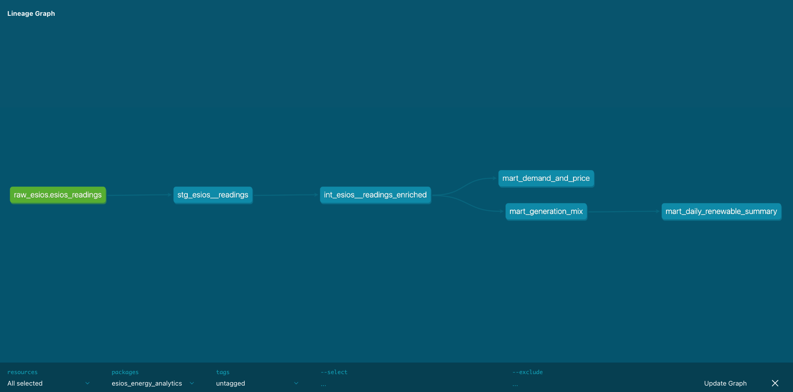

# End-to-End ELT Pipeline (dbt · DLT · BigQuery · Python): Spanish Electricity System Analytics


Real-world ELT pipeline ingesting live data from the Spanish electricity system operator (REE/ESIOS) into BigQuery, transformed with dbt Core using production-grade patterns: incremental models, data tests, macros, and CI/CD.

Built to demonstrate end-to-end data engineering with real API data — not synthetic datasets.

---

## Architecture

```
ESIOS API (REE)
      │
      ▼
   DLT (Python)          ← Incremental ingestion, schema inference
      │
      ▼
BigQuery: raw_esios      ← Bronze layer — raw data, never modified
      │
      ▼
dbt staging              ← Silver — type casting, UTC normalization, renaming
      │
      ▼
dbt intermediate         ← Silver — business logic, renewable flags, enrichment
      │
      ▼
dbt marts                ← Gold — aggregated analytical tables
```



---

## Stack

| Layer | Tool | Purpose |
|---|---|---|
| Ingestion | DLT (Python) | API extraction, incremental loading, schema management |
| Storage | Google BigQuery | Cloud data warehouse |
| Transformation | dbt Core | Modular SQL transformations, tests, docs |
| CI/CD | GitHub Actions | Automated dbt run + test on every push |
| Language | Python 3.13 | Pipeline orchestration |

---

## Dataset

Data sourced from [ESIOS API](https://api.esios.ree.es/) (Red Eléctrica de España), the Spanish electricity system operator.

**Indicators extracted:**

| Indicator ID | Name | Type |
|---|---|---|
| 1293 | Real demand | Demand |
| 460 | Wind generation | Generation (renewable) |
| 541 | Solar PV generation | Generation (renewable) |
| 1775 | Hydro generation | Generation (renewable) |
| 1776 | Nuclear generation | Generation |
| 1777 | Coal generation | Generation |
| 1778 | Combined cycle generation | Generation |
| 544 | Spot market price | Price |

**Coverage:** 2024–2025 · Hourly granularity · ~140,000 rows per indicator

---

## Key Technical Decisions

### Incremental model in staging

The staging model uses `incremental` materialization with `merge` strategy. On the first run it loads all historical data. On subsequent runs it only processes rows newer than the latest `ts_utc` already in the table — avoiding full scans on millions of rows.

### UTC as canonical timestamp

ESIOS returns timestamps in local Spanish time (CET/CEST). Spain changes clocks twice a year — on DST rollback days, the same local hour occurs twice. Using `datetime_utc` as the canonical timestamp avoids this ambiguity. Local timestamps are preserved for reference but never used as join keys.

### DST duplicate rows in marts

`mart_demand_and_price` intentionally has no `unique` test on `ts_utc`. On DST changeover dates (last Sunday of October), the clock rolls back one hour, producing two legitimate rows for the same UTC timestamp. This is documented in the model's yml and reflects real-world data behaviour.

### Price unit conversion via macro

ESIOS returns spot market price in mEUR/MWh (milieuro per MWh). The `convert_meur_to_eur()` macro handles the conversion to EUR/MWh in the marts layer. Raw data is preserved unmodified in the Bronze layer.

### April 28 2025 blackout

The dataset covers the Spanish national blackout of April 28, 2025. Real demand data shows the collapse from ~304,000 MW at 09:00 UTC to ~3,900 MW at 11:00 UTC, with spot market price dropping to zero during the outage. This event is visible in `mart_demand_and_price` filtered to `date_utc = '2025-04-28'`.

---

## dbt Models

```
transform/models/
├── staging/
│   ├── stg_esios__readings.sql        ← incremental, unique_key=_dlt_id
│   ├── stg_esios__readings.yml        ← tests: not_null, unique, accepted_values
│   └── sources.yml
├── intermediate/
│   ├── int_esios__readings_enriched.sql  ← renewable flag, technology name, data type
│   └── int_esios__readings_enriched.yml
└── marts/
    ├── mart_generation_mix.sql           ← hourly generation by technology, % renewable
    ├── mart_demand_and_price.sql         ← demand vs spot price, anomaly flags
    ├── mart_daily_renewable_summary.sql  ← daily renewable vs non-renewable aggregation
    └── marts.yml
```

---

## Project Structure

```
esios-energy-analytics/
├── ingestion/
│   ├── pipeline.py          ← DLT pipeline: extraction + incremental load to BigQuery
│   └── test_api.py          ← API connectivity test
├── transform/               ← dbt Core project
│   ├── models/
│   │   ├── staging/
│   │   ├── intermediate/
│   │   └── marts/
│   ├── macros/
│   │   └── convert_price.sql
│   └── dbt_project.yml
├── images/
│   └── lineage_graph.png
├── .github/
│   └── workflows/
│       └── dbt_ci.yml       ← CI: dbt run + dbt test on push to main
└── .env.example
```

---

## Setup

### Prerequisites

- Python 3.11+
- Google Cloud project with BigQuery enabled
- ESIOS API token (request at consultasios@ree.es)
- dbt Core with BigQuery adapter

### Installation

```bash
git clone https://github.com/robertofernandezmartinez/esios-energy-analytics.git
cd esios-energy-analytics
python -m venv .venv
source .venv/bin/activate
pip install "dlt[bigquery]" dbt-bigquery python-dotenv requests python-dateutil
```

### Configuration

Create a `.env` file in the project root:

```
ESIOS_TOKEN=your_token_here
DESTINATION__BIGQUERY__LOCATION=EU
```

Configure `~/.dbt/profiles.yml`:

```yaml
esios_energy_analytics:
  target: dev
  outputs:
    dev:
      type: bigquery
      method: oauth
      project: your-gcp-project-id
      dataset: dbt_dev
      threads: 4
      timeout_seconds: 300
      location: EU
```

### Run

```bash
# Ingest data from ESIOS API to BigQuery
python ingestion/pipeline.py

# Transform with dbt
cd transform
dbt run
dbt test
dbt docs generate && dbt docs serve
```

---

## Notes on ESIOS API

The ESIOS token is issued for personal use by REE. To reproduce this project you need to request your own token at `consultasios@ree.es`. The pipeline includes a 1-second pause between API calls to comply with REE's responsible use policy.

---

## Snowflake Port

The pipeline was partially ported to Snowflake to document cross-warehouse differences.

**What was completed:**
- Snowflake trial account configured (GCP, Frankfurt region)
- DLT pipeline successfully loading data to Snowflake (`ESIOS_ANALYTICS` database)
- dbt connection configured and verified via `dbt debug --target snowflake`
- SQL type incompatibilities identified and resolved (e.g. `FLOAT64` → `FLOAT`, `SAFE_DIVIDE` → `DIV0`)

**Key differences observed vs BigQuery:**

| Aspect | BigQuery | Snowflake |
|---|---|---|
| Compute model | Serverless, pay per TB scanned | Virtual warehouses, pay per compute time |
| Database identifier | Project ID with hyphens (`esios-energy-analytics`) | Clean name (`ESIOS_ANALYTICS`) |
| Float type | `FLOAT64` | `FLOAT` |
| Safe division | `SAFE_DIVIDE(a, b)` | `DIV0(a, b)` |
| Auth method | OAuth / Service Account | Username + password / key pair |
| Default region | Must specify (`EU`) | Selected at account creation |
| dbt profile method | `oauth` or `service-account-json` | `user` + `password` |

**Conclusion:** Both warehouses support the full dbt transformation layer. The main adaptation required is SQL type compatibility, which in a production setup would be abstracted via dbt macros (e.g. `{{ float_type() }}`).

---

## Author

[Roberto Fernández Martínez](https://www.linkedin.com/in/robertofernandezmartinez/) · Analytics Engineer